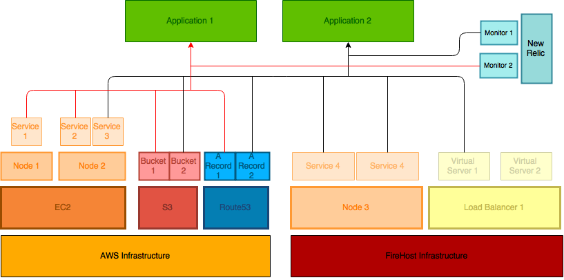
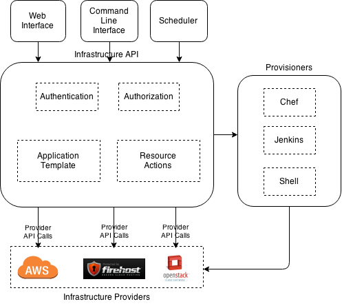
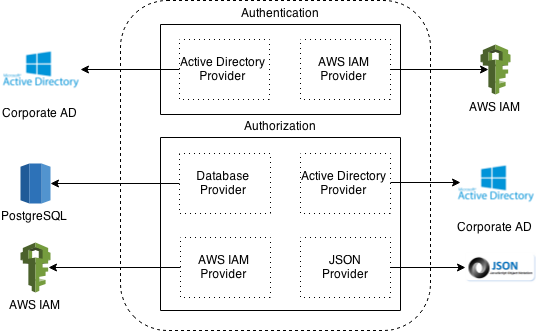

This document describes the high-level design of hCentive's cloud resources management tool creatively called CloudManage.

## Introduction
Current hCentive application hosting infrastructure is deployed to Amazon Web Services (AWS) and FireHost. As infrastructure resources are added over time, it has become difficult to manage them efficiently. Fine-tuning resource allocation based on predicted and actual utilization can improve usage efficiency. Also, automating resource management using the infrastructure provider's APIs can reduce dependency on manual processes.

Most resources are owned by various project groups within their respective cost centers. Each cost center and project has an infrastructure budget allocated to it. It makes sense to allow these groups to manage their resources by giving them control of the infrastructure. This enables a faster turnaround for infrastructure management requests by reducing dependency on the operations team. Also, providing insight into costs to teams encourages them to use resources efficiently.

Applications are composed of resources provisioned in different cloud providers. This tool should allow operators to select components from different providers. For example, a PHIX application will use the DNS service from AWS, application and database servers at FireHost, S3 buckets for backups are pushed to AWS, monitoring is set up in Nagios in AWS and NewRelic.



An application's resources layout is a graph with creation of some resources dependent on others. For example, a DNS entry cannot be created until the server is created. The tool should be able to define this resource dependency.

## <a name="requirements"></a>Requirements
* Categorize resources based on cost center, project, stack and owner.
* Limit access to resources based on the above categories.
* Define and manage lifetime of resources.
* Allow resources to be made available based on schedule.
* Create application templates from various resources.
* Provision and configure servers with Chef, Jenkins, shell scripts, or other provisioning tools.
* Allow assigning budgets to cost centers, projects, stacks and owners.
* Optimize resource usage through utilization reports.
* Provide insight into infrastructure through extensive reporting.
* Manage resources across infrastructure providers.
* Monitor health of infrastructure.
* Report compliance violations.

## <a name="solution"></a>Solution
A number of proprietary and open source infrastructure management solutions are available. But none of them meet all of hCentive's requirements.

#### <a name="ostrato"></a>Ostrato
Ostrato meets a lot of hCentive's requirements to manage low level resources. Ostrato's development team is open to adding new features. hCentive is currently using this tool to manage it's AWS infrastructure.

Although it is great with our current requirements, our custom requirements will probably not be in their future releases. It can only manage our AWS infrastructure at the moment. Also, Ostrato comes at a significant cost.

#### <a name="aws-console"></a>AWS Management Console
AWS management console can used with Identity and Access Management (IAM) to grant access to users restricted by resource tags. The categories mentioned in the [requirements](#requirements) can be set as resource tags. Custom development, using the AWS API, is required to meet the other requirements.

#### <a name="cloud-manage"></a>CloudManage
hCentive's custom solution will be built from the ground up using infrastructure provider APIs. Release cycles will add features to meet <a href="#requirements">requirements</a> based on hCentive's priorities. It will also be able to use a number of utilities that the company has already written to manage it's infrastructure.

## <a name="design"></a>Design
CloudManage is developed using an API first approach. This allows access to the infrastructure using different interfaces. For example, command line and web interfaces, and HTTP web service interface for, say, resource schedulers or mobile apps. All clients use the API in a consistent fashion.

The infrastructure API encapsulates the authentication and authorization components, as well as the resource actions and application templates. Each of these components abstracts out it's respective functionality to enable using different providers. For example, authentication can be provided by LDAP or AWS IAM but the authentication component's interface will remain consistent across the providers. Similarly, resource action components can abstract out infrastructure provider APIs. For example, a server restart API call will have the same signature, for the user, regardless of the infrastructure provider (AWS, FireHost, etc.).

The API will provide a way to provision infrastructure components using various provisioners like Jenkins and Chef. Currently, provisioning is triggered manually after the infrastructure components are provisioned.



#### <a name="auth"></a>Authentication and Authorization
Before performing any actions in CloudManage, the connecting client must be authenticated. Authentication is pluggable via authentication providers. For example, an Active Directory authentication provider that authenticates users against hCentive's corporate Active Directory. Another example is an AWS IAM provider that authenticates users against AWS's Identity and Access Management database.

Authorization is the process of determining what actions a user is allowed to perform. It is implemented through access control policies (ACLs). Policies are described in JSON, and can use a number of providers to retrieve user and their group information.



#### <a name="inventory"></a>Resource Inventory
CloudManage can import existing resources deployed with the supported cloud providers. It can also create new resources. Resources are assigned different categories to enable access control based on a combination of categories. An example of resources are server instances, storage volumes, DNS entries, etc.

Access control policies are defined on categories to which resources are assigned. The policies are definition is cloud provider agnostic, and are transformed into provider specific policies depending on where the resources are deployed.

##### <a name="resource-providers"></a>Providers
Infrastructure resources are provided by IaaS (and SaaS) providers like AWS, FireHost, NewRelic, etc. Not all IaaS providers will have the same set of resources available. But there are some components that are available across providers. For example, compute instances and storage volumes are available in both AWS and FireHost. Provider API is agnostic of the specific underlying infrastructure provider.

Providers are provisioned with simple `json` configuration. For example, the AWS provider's configuration looks like this
```json
"providers": [
  {
    "provider": "aws",
    "aws-accesskey": "...",
    "aws-secretkey": "..."
  }
]
```

##### <a name="resource-categories"></a>Categories
Resources are assigned categories depending business function assigned to them. For example, a set of application servers that belong to the PHIX cost center's product QA group will have the `phix`, `product` and `qa` categories assigned to them.

Assigning categories allows resources to be queried or filtered by the assigned categories. It also permits implementing access control policies based on categories. For example, the PHIX product QA user group can be restricted to access only the resources that have the `phix`, `product` and `qa` categories assigned to them.

The [infrastructure provider](#resource-providers) is responsible for interpreting the access control policies and enforcing it on the infrastructure. For example, the AWS provider can enforce the policy using [IAM with resource tags](http://blogs.aws.amazon.com/security/post/Tx29HCT3ABL7LP3/Resource-level-Permissions-for-EC2-Controlling-Management-Access-on-Specific-Ins).

Categories are defined at a higher, abstract level and implemented by providers. The provider configuration defines the mapping between CloudManage categories and the provider's resource categories. For example, the `category-mapping` for AWS resource tags will look like this
```json
"providers": [
  {
    "provider": "aws",
    "aws-accesskey": "...",
    "aws-secretkey": "...",
    "category-mapping": {
      "cost-center": "cost-center",
      "created-date": "created",
      "expiry-date": "expires",
      "name": "Name",
      "owner": "owner",
      "stack": "stack",
      "calendar": "calendar"
    }
  }
]
```

#### <a name="template"></a>Application Templates
Resources are combined together to compose applications. An application template defines the resources in an application. AWS implements it using CloudFormation templates. Other providers can have their own templating formats or specifications. Most applications deployed by hCentive use more than one infrastructure provider. Therefore, it cannot use specifications of any single provider to define its application templates. A custom specification is required to define applications.

The application template will specify the resource provider with the resource definition. It will also defines resource dependencies for resources that rely on another resource attributes.

A sample application template could look like this

```json
{
  "name": "phix-product-qa",
  "tags": {
    "Name": "phix-product-qa",
    "cost-center": "phix",
    "project": "product",
    "stack": "qa",
    "owner": "ritesh.dugar@hcentive.com",
    "ticket-id": "INFRA-1234"
  },
  "instances": {
    "host": [
      {
        "provider": "aws-ec2",
        "name": "web01-hostname",
        "instance-type": "t2.micro",
        "ami": "phix-web-foundation",
        "subnet-id": "subnet-abcd1234",
        "key-name": "ITSupport",
        "calendar": "phix-qa-weekdays-ist"
      }
    ],
    "dns-record": [
      {
        "provider": "aws-route53",
        "type": "A",
        "name": "phix-qa-01.demo.hcentive.com",
        "zone": "demo.hcentive.com",
        "record": [
          {"${instances.host.web01-hostname.public-ip-address}"}
        ]  
      },
      {
        "provider": "activedirectory",
        "type": "A",
        "name": "phix-qa-01.demo.hcentive.com",
        "zone": "demo.hcentive.com",
        "record": [
          {"${instances.host.web01-hostname.private-ip-address}"}
        ]  
      }
    ]
  }
}
```

#### <a name="provisioners"></a>Provisioners
This section describes provisioners for infrastructure components.

#### <a name="clients"></a>Clients
This sections describes clients for the infrastructure API.

##### <a name="cli"></a>Command Line Interface
This section describes the command line interface to the API.

##### <a name="web"></a>Web Interface
This section describes the web interface to the API.

##### <a name="other"></a>Other interfaces
This section describes other interfaces to the API, like a resource scheduler or mobile applications.
